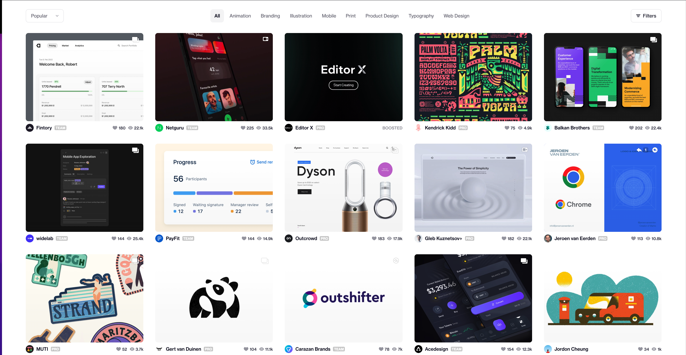

## Présentation du sujet

Cette étude de cas consiste à développer une application pour s'authentificer, visualiser et liker des images.

#### 1. Authentification

Cette première phase consiste à reproduire (best effort) l'écran ci-dessus avec les trois scnéarios suivants:

- L'authentification avec `muser1/mpassword1` doit fonctionner sans erreur
- L'authentification avec `muser2/mpassword2` doit fonctionner sans erreur
- L'authentification avec `muser3/mpassword3` doit afficher un message d'erreur `Ce compte a été bloqué.`
- L'authentification avec toute autre information doit afficher un message d'erreur `Informations de connexion invalides`

#### 2. Listing photos

Cette second phase consiste à lister un ensemble d'images en utilisant l'API https://unsplash.com/developers. Vous aurez besoin de créer un compte développeur pour mener à bien cette évaluation.
Il est important d'implémenter un système de pagination ou infinite scrolling.

#### 3. Likes photos

En bas de chaque photo, une icône doit permettre à l'utilisateur connecté de liker la photo.
Si un utilisateur a déjà liké la photo, l'îcone devrait clairement indiquer celà.

#### 4. Contraintes

- Le développement doit être fait avec NextJS
- La base de données à utiliser est https://github.com/Level/level

#### 5. Livrables

- Le lien vers le repository Github contenant le code source du projet
